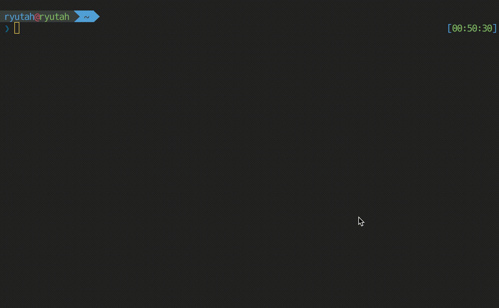
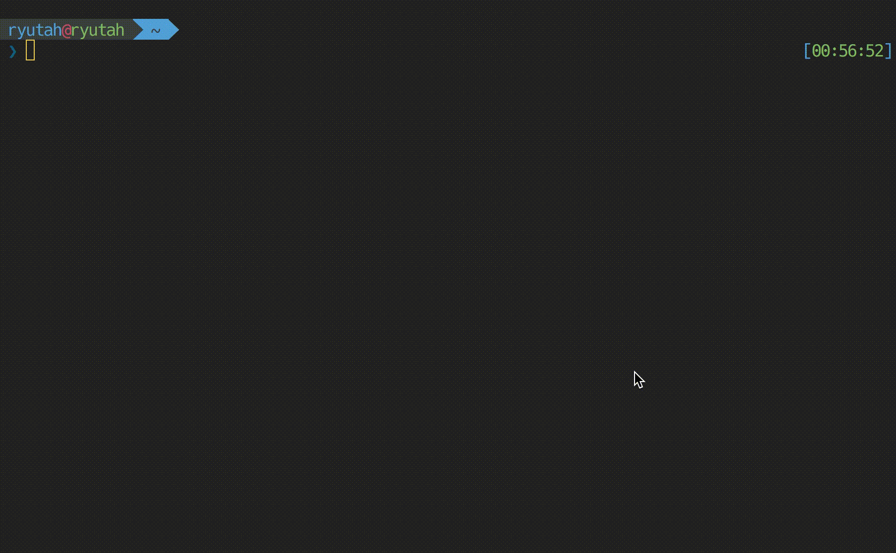

なんかのセットアップスクリプトとか、OSSだとよくあるような↓みたいなやつ

```console
curl -sL https://xxxxxxxxxxxxxxxx/install.sh | sh
```

余計なものDLしないでサクッとセットアップできるので個人的にお気に入りなんで自分でもやってみようって気持ちになった。

対して難しくもないやろーと思ってたけど、地味に10分くらい悩んだことが会ったのでメモ書き程度に残しておく

## 問題点

かなり簡略化してるけど、問題になったのはこんなシェル



つまり **標準入力を受け付ける様にしたかった** わけです。

これを普通にcurl経由で実行しようとすると

```console
curl -s https://gist.githubusercontent.com/ryutah/6f707deccdb02e504887f821af749dc7/raw/0e47b258345c0f20868bba3eafa156dd28df9d42/sample.sh | sh
```

こうなるわけなんだけど、こうやって実行するとこんな感じの結果になる



悲しいことに、標準入力を受け付けられないと。。。

## 解決方法

さて、このままじゃ困るぞってことで早速解決方法を

```console
bash <(curl -s https://gist.githubusercontent.com/ryutah/6f707deccdb02e504887f821af749dc7/raw/0e47b258345c0f20868bba3eafa156dd28df9d42/sample.sh)
```

こんな感じで実行すれば標準入力受けれる様になる!



とまあ、知ってる人からすりゃ当たり前のことだと思うんだけど、ググりワードを考えるのが地味にめんどくさかった。

## 参考リンク

- [misty-magic.h - curl経由で実行するシェルスクリプトで標準入力を使いたい](https://mistymagich.wordpress.com/2016/09/21/curl%E7%B5%8C%E7%94%B1%E3%81%A7%E5%AE%9F%E8%A1%8C%E3%81%99%E3%82%8B%E3%82%B7%E3%82%A7%E3%83%AB%E3%82%B9%E3%82%AF%E3%83%AA%E3%83%97%E3%83%88%E3%81%A7%E6%A8%99%E6%BA%96%E5%85%A5%E5%8A%9B%E3%82%92/)
